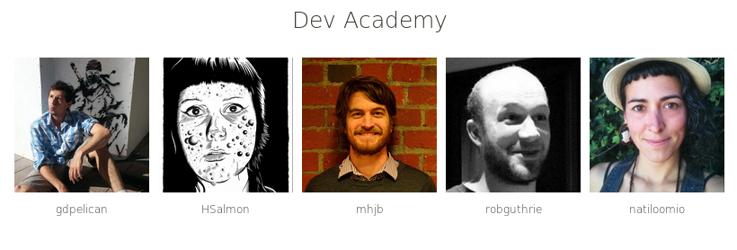

# Full-stack

## Intro

Today we'll walk through the steps of a simple full-stack JavaScript app.

What it will look like is an application which shows us everyone who is in our cohort / school.
It might also show us details on a particular student.

We'll do this by building a server which does 2 things: 
 - provides an API
 - serves client-side pages (html, css, bundled js)

The client-side page will be loaded, then immediately ask for some data from the API.
The results will be rendered into the page using a renderer bundled into your client-side JS.

**Challenge** - too hard? Go get some hints on the [standard README](README.nd)

## Release 0: Static file server.

Make a basic setup which can serve up an `index.html` file, making sure we keep the files we want to give to the client in a `client` folder.

Spin up your server and make sure you can use it to get it to serve your `index.html` file.

## Release 1: Client-side JavaScript

Set up client side javascript - you'll need to set up Browserify.
We're going to keep our files nice and seperate, have our source dev file called `src/index.js` and have Browserify ouput to `client/app.js`.

_Bonus points: minify your bundled js_

---

> Do 2a / 2b in either order.

---

## Release 2a: Client-side templating

Choose a templating language of preference and install it so that it work in you client-side js.

Write tests for your templates (either use Cheerio for hyperscript or figure out a way to test another templating language), and build them TDD.

Reload your `index.html` and prove your templating is working.
You should be be able to see at least 2 student rendered on the page

## Release 2b: Add a JSON API to your server

Adjust your express server (`./server.js`) to serve a JSON array using a RESTful route for your student resources.

Write tests for your API (using supertest), build it TDD.
 
Navigate your browser to localhost:[PORT]/api/v1/students in you browser, or using Postman to check the api is working

## Release 3: Client-server messaging

Link your Client-side js to your API.
Have the page automatically request the current students data, then renderer those results to the page.

You should see all students rendered on the page.

Stretch - add a listener to each student, so that when clicked the view is changed to just that student record (perhaps with more detail, and a larger photo). You might like to include another RESTful route for practice, to fetch that specific student (e.g. `api/v1/students/5`)

Add a button to your html. In your **client-side** JavaScript setup an event listener on the button and executes an ajax GET request to **server** `localhost:[PORT]/api/vi/students` (you can do this with JQuery, superagent, xhr, etc.)

## Release 4: Finesse

Now we're going to set things up so that we don't have to keep restarting the server or re-bundling our client JavaScript each time we make a change.

Now you should be able to run `npm run serve` in one terminal and `npm run wach-client` in another. When you change the your client/app.js it will be automatically re-bundled (you will still need to re-start the server to re-serve the fresh bundle.js).

When you make changes to your `server.js` and save it will automatically restart.

Background:

 * [Task Automation with npm run](http://substack.net/task_automation_with_npm_run)

 * [Browserify handbook](https://github.com/substack/browserify-handbook#watchify)

## Release 6: File-system persistance

At the moment our server just serves data defined in our server and held in memory. Let's use the file system to persist our data.

## Release 7: Test-driven

You already did things in the write order (building TDD).
Well done.

Move on.

## Release 8a: Queryable 

Teach your API to respond to query params like `/api/vi/students?nationality=new+zealander` and return only matching results

## Release 8b: Local networking.

Split it the server.js into 2 and introduce an external API. In your pair decide who will serve the teachers and who will server the students.

1. Add and commit your changes and push them to the repo.
1. One person will clone the repo and branch off the pair's branch.
1. Both of you will need to find your own ip address on the local network
1. Setup your server's so that one of you has the teachers and the other the students in your db.json.
1. When a server recieves a GET for `/users` it will make a GET to your partner's server and respond to the client with both teachers and students.

---

## Resources

Number| Name
------|-------------------
.     | [Task Automation with npm run](http://substack.net/task_automation_with_npm_run)
.     | [Browserify handbook](https://github.com/substack/browserify-handbook#watchify)
.     | [supertest](https://www.npmjs.com/package/supertest)
.     | [Jquery from a cdn](https://developers.google.com/speed/libraries/)
.     | [Full stack](http://www.laurencegellert.com/2012/08/what-is-a-full-stack-developer/)

